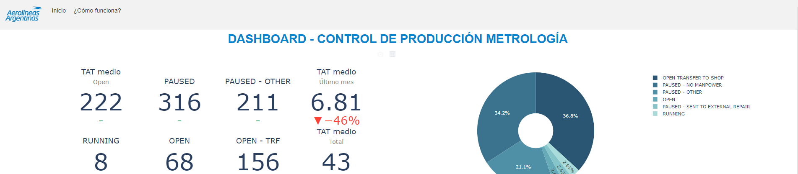

	

---

# DASHBOARD - CONTROL DE PRODUCCIÓN METROLOGÍA

## DESCRIPCIÓN DEL PROYECTO 🇪🇸

El dashboard del laboratorio de metrología es una herramienta visual que presenta información clave de manera organizada y fácilmente comprensible. Proporciona una visión general del desempeño y los resultados del laboratorio, permitiendo una supervisión y toma de decisiones más efectiva. A continuación, se describen algunas utilidades de un dashboard:

1. Monitoreo en tiempo real (Actualización semanal): Un dashboard que proporciona información actualizada cada semana sobre el estado de las calibraciones, mediciones y otros procesos críticos del laboratorio. Esto permite a los responsables y al personal de laboratorio monitorear la productividad, identificar problemas o retrasos, y tomar medidas correctivas de manera oportuna.

2. Visualización de indicadores clave de rendimiento (KPIs): Permite mostrar una variedad de KPIs relevantes para el laboratorio de metrología, como el número de calibraciones realizadas, ordenes abiertas, eficiencia del personal (con TAT medio), cumplimiento de plazos, ordenes pausadas, ente otros. Estos indicadores ayudan a evaluar el rendimiento general y la calidad de las mediciones, permitiendo un seguimiento continuo y la identificación de áreas de mejora.

3. (TO-DO) Análisis de tendencias y patrones: El dashboard puede presentar datos históricos y tendencias a lo largo del tiempo, lo que facilita la identificación de patrones, cambios estacionales o fluctuaciones en la demanda de servicios de calibración. Esta información es valiosa para la planificación de recursos, la optimización de la capacidad y la toma de decisiones estratégicas.

4. Gestión eficiente de la carga de trabajo: Mediante la visualización de la carga de trabajo actual y futura, Este elemento ayuda a distribuir de manera equitativa las tareas y asignar recursos adecuadamente. Esto permite evitar cuellos de botella, minimizar tiempos de espera innecesarios y garantizar una gestión eficiente de los proyectos y las prioridades. Se prevee  que pueda incorporarse las licencias vacacionales de los metrólogos con el finde de planificar las tareas según la disponibilidad.

5. Comunicación interna y externa: El dashboards ofrecen una forma clara y concisa de comunicar información relevante tanto dentro del laboratorio como a los directivos y clientes externos. Muestran plazos, fechas de entrega estimados, estados de las calibraciones y otros datos importantes, mejorando la transparencia y la eficacia de la comunicación en todos los niveles.

---

## PROJECT DESCRIPTION 🇺🇸

The metrology lab dashboard is a visual tool that presents key information in an organized and easily understandable way. Provides an overview of laboratory performance and results, enabling more effective monitoring and decision-making. Some dashboard utilities are described below:

1. Real-time monitoring (Weekly Update): A dashboard that provides weekly updated information on the status of calibrations, measurements, and other critical laboratory processes. This allows managers and laboratory personnel to monitor productivity, identify problems or delays, and take corrective action in a timely manner.

2. Display of key performance indicators (KPIs): Allows you to display a variety of KPIs relevant to the metrology laboratory, such as the number of calibrations performed, open orders, staff efficiency (with average TAT), deadline compliance, paused orders , among others. These indicators help to assess the overall performance and quality of the measurements, allowing continuous monitoring and the identification of areas for improvement.

3. (TO-DO) Trend and pattern analysis: The dashboard can present historical data and trends over time, making it easy to identify patterns, seasonal changes, or fluctuations in demand for calibration services. This information is valuable for resource planning, capacity optimization, and strategic decision making.

4. Efficient workload management: By visualizing the current and future workload, this element helps to evenly distribute tasks and allocate resources appropriately. This allows you to avoid bottlenecks, minimize unnecessary waiting times and ensure efficient management of projects and priorities. It is expected that the vacation leaves of the metrologists can be incorporated in order to plan the tasks according to availability.

5. Internal and external communication: Dashboards offer a clear and concise way to communicate relevant information both within the laboratory and to external managers and clients. They show deadlines, estimated delivery dates, calibration statuses and other important data, improving the transparency and effectiveness of communication at all levels.

---

Powered by Python 

*Developed by Ing. Aer. Pablo Bauer*
